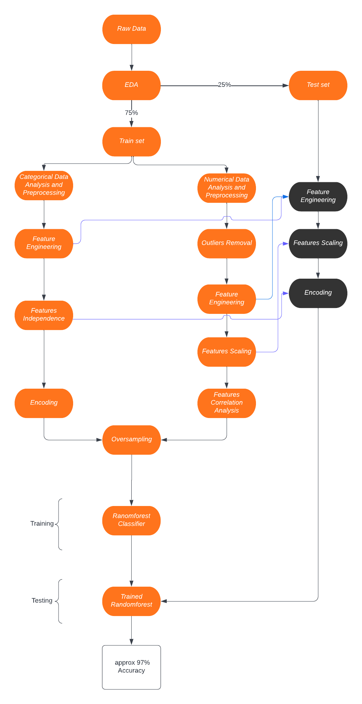

# Customer-Churn-Prediction

Customer churn predicition is a *binary classifcation* problem to decide whether a customer will change his tellecommuncation provider or not.

The problem and the dataset can be found on  <a href="https://www.kaggle.com/c/customer-churn-prediction-2020">a kaggle competetion</a>

**Solution Structure**

  

